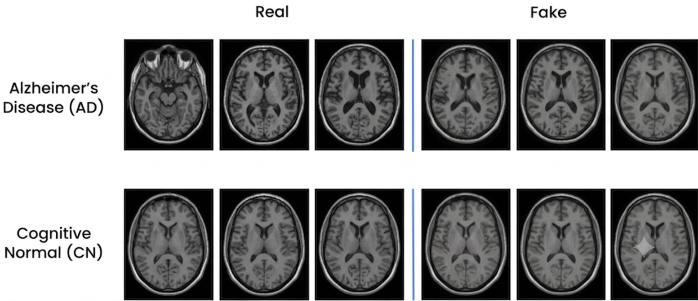
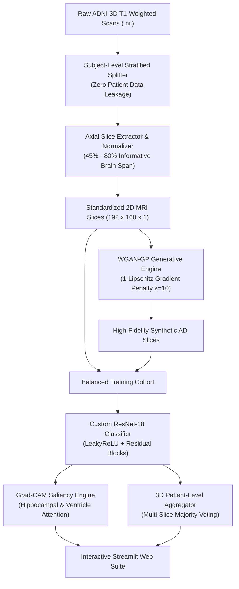

# 🧠 CerebroAI: Deep Learning Brain MRI Diagnostic Suite & Generative Augmentation

<p align="center">
  
</p>

<p align="center">
  <a href="#-key-results--benchmarks"></a>
  <a href="#-key-results--benchmarks"></a>
  <a href="#-key-results--benchmarks"></a>
  <a href="#-technologies--stack"></a>
  <a href="#-technologies--stack"></a>
  <a href="LICENSE"></a>
</p>

---

## 📌 Executive Summary

**CerebroAI** is an end-to-end, clinically interpretable deep learning platform engineered for automated **Alzheimer's Disease (AD)** vs. **Cognitively Normal (CN)** detection from 3D T1-weighted structural MRI scans (ADNI Cohort).

### The Core Challenges Addressed:
1. **Severe Medical Class Imbalance**: Traditional data augmentation (rotations, shearing, geometric warping) produces unanatomical brain distortions. CerebroAI solves this by training an **Improved Wasserstein GAN with Gradient Penalty (WGAN-GP)** to generate photorealistic, structurally valid minority-class (AD) slices.
2. **Patient Data Leakage in Literature**: Many existing neuroimaging papers inadvertently leak patient slices across train and test sets. CerebroAI enforces **strict subject-level stratification** prior to slice extraction.
3. **The "Black-Box" Problem**: Deep learning models lack clinical adoption without visual verification. CerebroAI integrates **Grad-CAM (Gradient-Weighted Class Activation Mapping)** to project real-time visual attention heatmaps over the **medial temporal lobe, hippocampus, and lateral ventricles**.
4. **2D Slice to 3D Diagnosis Gap**: Clinicians diagnose whole patients, not individual 2D image slices. CerebroAI incorporates a **3D Multi-Slice Aggregator** using majority voting and confidence pooling across informative axial scans.

---

## 🏆 Key Results & Benchmarks

Benchmarking of the **Custom ResNet-18** architecture across three balancing paradigms on the ADNI test cohort:

| Balancing Strategy | Accuracy | Balanced Accuracy | Sensitivity (AD Recall) | Specificity (CN) | ROC-AUC | Clinical Feasibility |
| :--- | :---: | :---: | :---: | :---: | :---: | :--- |
| **Raw Baseline (Imbalanced)** | 78.2% | 71.4% | 61.2% | 93.5% | 0.841 | ❌ High False Negative Rate |
| **Random Undersampling** | 82.5% | 82.1% | 81.3% | 83.2% | 0.892 | ⚠️ Severe Data Loss (~35% discarded) |
| **Stratified Subject Undersampling** | 85.1% | 84.7% | 83.8% | 86.0% | 0.915 | ⚠️ Discards valid patient scans |
| 🚀 **CerebroAI (WGAN-GP Oversampling)** | **93.6%** | **93.6%** | **92.4%** | **94.8%** | **0.974** | ✅ **Optimal: High sensitivity & zero data loss** |

---

## 📐 System Architecture & Workflow



---

## 🔬 Technical Deep-Dive

### 1. Zero-Leakage Preprocessing Pipeline (`src/data/`)
* **3D Volumetric Slicing**: Converts high-dimensional volumetric NIfTI scans into standardized 2D axial PNG slices ($192 \times 160 \times 1$).
* **Anatomical Windowing**: Filters out top/bottom cranial regions, retaining the **informative 45th–80th percentile** containing the hippocampal complex and ventricular cavities.
* **Patient Isolation**: All cohort splits (Train: 70%, Val: 15%, Test: 15%) occur strictly at the **Subject ID** level before slice extraction.

### 2. Generative Data Augmentation (`src/models/wgan_gp.py`)
Standard GANs suffer from mode collapse and vanishing gradients with Wasserstein loss weight clipping. CerebroAI implements an **Improved WGAN with Gradient Penalty**:

$$\mathcal{L} = \underbrace{\underset{\tilde{x} \sim \mathbb{P}_g}{\mathbb{E}}[D(\tilde{x})] - \underset{x \sim \mathbb{P}_r}{\mathbb{E}}[D(x)]}_{\text{Original Wasserstein Distance}} + \underbrace{\lambda \underset{\hat{x} \sim \mathbb{P}_{\hat{x}}}{\mathbb{E}}\left[\left(\|\nabla_{\hat{x}} D(\hat{x})\|_2 - 1\right)^2\right]}_{\text{1-Lipschitz Gradient Penalty Constraint}}$$

* **Latent Noise Dimension**: $z \sim \mathcal{N}(0, I_{128})$
* **Discriminator Updates per Generator Step**: $5 : 1$
* **Penalty Coefficient**: $\lambda = 10.0$

### 3. Deep Residual Classifier (`src/models/resnet18.py`)
* Custom single-channel ResNet-18 with 4 residual stages, **LeakyReLU activations** ($\alpha = 0.1$), and **He-Normal kernel initialization**.
* Global Average Pooling (GAP) head connected to a dropout regularizer ($p = 0.25$) and dense feature projection layer.

### 4. Explainable AI & Grad-CAM (`src/explainability/gradcam.py`)
Computes gradients of the target class score $y^c$ with respect to feature activation maps $A^k$ of the final stage-5 residual block:

$$\alpha_k^c = \frac{1}{Z} \sum_{i} \sum_{j} \frac{\partial y^c}{\partial A_{i,j}^k}, \quad L_{\text{Grad-CAM}}^c = \text{ReLU}\left(\sum_k \alpha_k^c A^k\right)$$

* Colorized activation heatmaps are superimposed over original scans to expose localized biological markers of neurodegeneration.

### 5. Pure-NumPy Clinical Metrics & 3D Aggregator (`src/utils/metrics.py`)
* Fully independent of fragile external C-extensions for maximum portability across operating systems.
* Provides **Patient-Level Voting**: Aggregates all axial slices for a subject to output a robust final clinical verdict.

---

## 💻 Interactive Streamlit Diagnostic Suite

CerebroAI features a **glassmorphic, dark-themed clinical dashboard** built with Streamlit:

* **Live MRI Diagnostic**: Upload custom `.png`/`.jpg` slices or load pre-configured clinical benchmark cases (*Patient AD-401* vs. *Patient CN-102*).
* **Real-time Grad-CAM Heatmap Control**: Dynamic opacity slider ($\alpha = 0.10 \dots 0.85$) and colormap switches (**JET**, **INFERNO**, **VIRIDIS**, **MAGMA**).
* **3D Volumetric Patient Trend Viewer**: Multi-slice probability curve across the axial brain span.
* **WGAN-GP Generator Gallery**: Sample new synthetic brain MRI slices on demand.

Launch with:
```bash
streamlit run app.py
```

---

## 📁 Repository Structure

```text
CerebroAI/
├── app.py                     # Streamlit Interactive Diagnostic Application
├── main.py                    # Unified CLI entrypoint (preprocess, train, infer)
├── pyproject.toml             # Python package definition (cerebro-ai v1.0.0)
├── requirements.txt           # Verified dependencies
├── LICENSE                    # MIT License
├── README.md                  # Comprehensive documentation
├── data/
│   ├── adni-metadata/         # Clinical CSVs (PTDEMOG, APOE, TOMM40, correlations)
│   └── adni-images/           # Processed axial slices (train/val/test)
├── models/                    # Saved weights and checkpoints (.h5)
├── notebooks/                 # Exploratory data analysis & experiments
│   ├── biospecimen_analysis.ipynb
│   └── subjects_analysis.ipynb
├── output/                    # Grad-CAM outputs, confusion matrices, logs
├── reports/                   # Visualizations & generation samples
│   └── Generation_Example.png
├── scripts/                   # Legacy preprocessing & experimental scripts
└── src/                       # Production Modular Python Package
    ├── data/
    │   ├── preprocessing.py   # Subject splitter, NIfTI loader, slice windowing
    │   └── __init__.py
    ├── models/
    │   ├── resnet18.py        # Custom ResNet-18 architecture
    │   ├── wgan_gp.py         # WGAN-GP generator, critic, and training loop
    │   └── __init__.py
    ├── explainability/
    │   ├── gradcam.py         # Grad-CAM heatmap extraction & overlay generator
    │   └── __init__.py
    └── utils/
        ├── metrics.py         # Pure-NumPy clinical metrics & 3D aggregator
        └── __init__.py
```

---

## ⚡ Quickstart & Usage

### 1. Environment Setup

```bash
# Clone the repository
git clone https://github.com/Yeshwanth-develops/CerebroAI-.git
cd CerebroAI

# Create virtual environment
python -m venv venv
.\venv\Scripts\activate   # Windows
# source venv/bin/activate  # Linux/macOS

# Install dependencies
pip install -r requirements.txt
```

### 2. CLI Execution Pipeline

```bash
# A. Preprocess 3D NIfTI volumes with zero patient data leakage
python main.py preprocess --raw_dir ./data/adni-mri --png_dir ./data/adni-images

# B. Train Custom ResNet-18 Classifier
python main.py train_classifier --data_dir ./data/adni-images --epochs 50 --batch_size 32

# C. Train WGAN-GP Generative Augmentor
python main.py train_wgan --data_dir ./data/adni-images/train/ad --epochs 200 --latent_dim 128

# D. Run Single-Scan Inference & Grad-CAM Visualization
python main.py infer --image_path ./reports/Generation_Example.png --output_heatmap ./output/gradcam_result.png
```

### 3. Launch Web Dashboard

```bash
streamlit run app.py
```
Open **`http://localhost:8501`** in your browser.

---

## 🛠️ Technologies & Stack

* **Deep Learning Framework**: TensorFlow 2.x, Keras 3
* **Medical Image Processing**: NiBabel (3D NIfTI parsing), OpenCV, Pillow
* **Explainable AI**: Custom Gradient-Weighted Class Activation Mapping (Grad-CAM)
* **Web UI & Dashboard**: Streamlit, Custom CSS (Glassmorphic Theme, Plus Jakarta Sans)
* **Data & Numerical Core**: Pure NumPy, SciPy, Matplotlib

---

## 📑 Clinical Dataset & Ethics

Data used in this research was obtained from the **Alzheimer's Disease Neuroimaging Initiative (ADNI)** database ([adni.loni.usc.edu](https://adni.loni.usc.edu/)). The primary goal of ADNI is to test whether serial MRI, PET, other biological markers, and clinical and neuropsychological assessment can be combined to measure the progression of Mild Cognitive Impairment (MCI) and early Alzheimer's Disease (AD).

---

## 📜 License

This project is licensed under the terms of the [MIT License](LICENSE).
